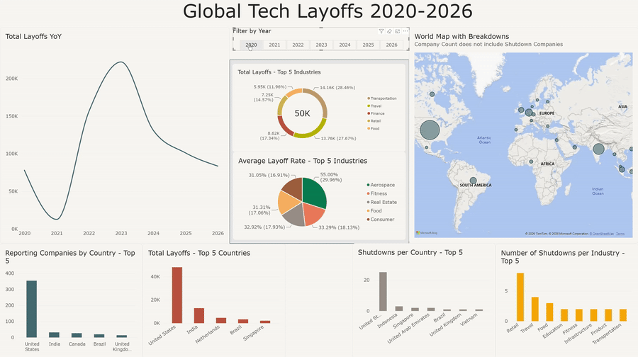

# Layoffs Analysis 2020-2026

## Overview: 
This is a complete, end to end data analysis of reported global tech layoffs from 2020 through 2026, covering the data cleaning process, SQL analysis, and a full write up.

---

## The Question: 
How did layoffs affect different industries and countries across the world?

---

## Tools Used: 
VS Code, Python/pandas, SQL Server extension

---

## Table of Contents:

- **data/** - a folder containing both the original csv file called layoffs.csv and layoffs_clean.csv [Original Layoff CSV](data/layoffs.csv) [Clean Layoffs](data/layoffs_clean.csv)

- **gitignore** - a file telling github what to ignore, in this case just the virtual environment I used.

- **Data_Analysis_Query** - an SQL file containing the queries used for the key findings. [Analysis Queries](Data_Analysis_Query.sql)

- **Data_Cleaning** - the python script where I utilized the pandas library to clean the data. [Data Cleaning Script](Data_Cleaning)

- **Data_Exploration.sql** - An sql file to explore query results from Data_Analysis_Query. [Data Exploration Queries](Data_Exploration.sql)

- **Layoffs Analysis Write Up.pdf** - the complete write up. [Full Write Up](Layoffs_Analysis_Write_Up.pdf)

- **requirements.txt** - a txt file containing the versions of each library I used.

---

## Key Findings Summary: 

Layoffs were widespread, with no obvious through-line pointing to any specific country or industry. While the US dominates in raw numbers, countries like Israel and Nigeria lead on percentages. 
Depending on what metrics and filters you apply, you can draw different conclusions that point at specific industries, countries, or certain years showing disproportionate impact, likely driven by broader economic events.

---

## Schema Design

This was the original schema I planned to use for the database, but the SQL Server extension on VS Code does not allow the adding of additional columns that do not already exist, it also has predetermined variables, such as VARCHAR(50) instead of VARCHAR(255). 
Since this was a small project and none of variables had any conflicts with the existing data, I thought it acceptable to use SQL Server's import function.

```sql
CREATE TABLE layoffs (
    id INT IDENTITY(1,1) PRIMARY KEY,
    company VARCHAR(255),
    location VARCHAR(255),
    total_laid_off INT,
    date DATE,
    percentage_laid_off DECIMAL(5, 2),
    industry VARCHAR(255),
    country VARCHAR(255)
)
```
---

## Global Tech Layoffs 2020-2026 Dashboard

This is a dashboard displaying data relevant to many of the key findings recorded in the write up, with some extra visuals to help contextualize the key findings. 




**Tools:** Power BI, SQL Server, Power Query
